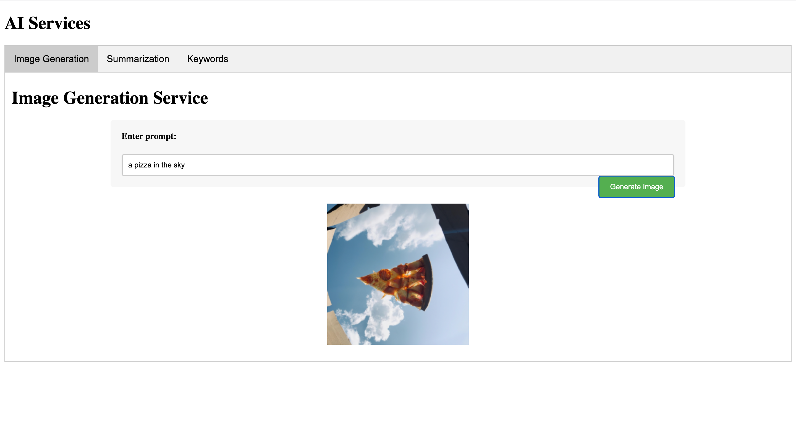
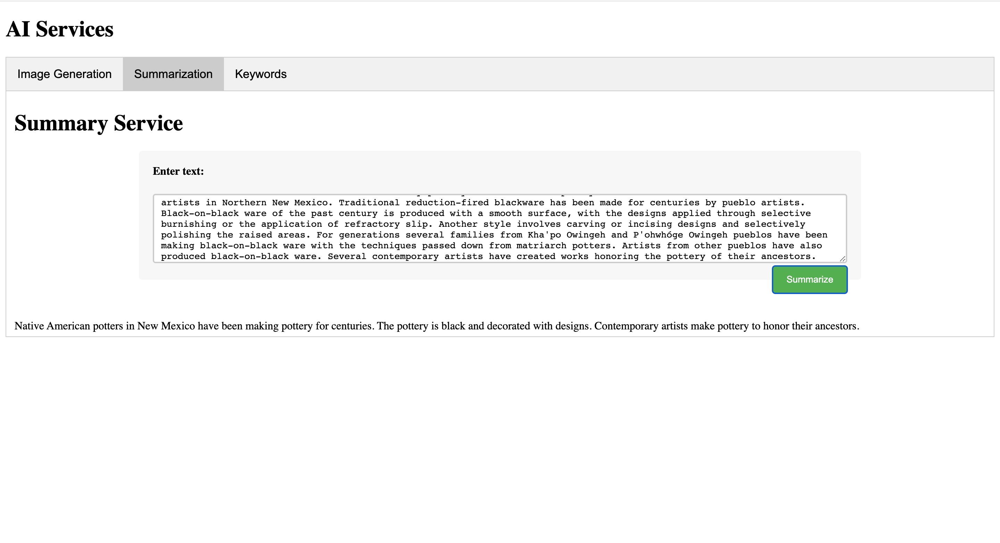

# AI Services

- Image Generation based on a prompt
- Summary for a second-grade student
- Extract keywords from a text




```bash
Summarize this for a second-grade student:

Black-on-black ware is a 20th- and 21st-century pottery tradition developed by the Puebloan Native American ceramic artists in Northern New Mexico. Traditional reduction-fired blackware has been made for centuries by pueblo artists. Black-on-black ware of the past century is produced with a smooth surface, with the designs applied through selective burnishing or the application of refractory slip. Another style involves carving or incising designs and selectively polishing the raised areas. For generations several families from Kha'po Owingeh and P'ohwhóge Owingeh pueblos have been making black-on-black ware with the techniques passed down from matriarch potters. Artists from other pueblos have also produced black-on-black ware. Several contemporary artists have created works honoring the pottery of their ancestors.
```


```
> Extract keywords from this text:

> Black-on-black ware is a 20th- and 21st-century pottery tradition developed by the Puebloan Native American ceramic artists in Northern New Mexico. Traditional reduction-fired blackware has been made for centuries by pueblo artists. Black-on-black ware of the past century is produced with a smooth surface, with the designs applied through selective burnishing or the application of refractory slip. Another style involves carving or incising designs and selectively polishing the raised areas. For generations several families from Kha'po Owingeh and P'ohwhóge Owingeh pueblos have been making black-on-black ware with the techniques passed down from matriarch potters. Artists from other pueblos have also produced black-on-black ware. Several contemporary artists have created works honoring the pottery of their ancestors.
```


### References:
- [summarize-openai-prj](https://github.com/nogibjj/rust-world-spr23/tree/main/summarize-openai-prj4)
- [openai-examples](https://platform.openai.com/examples)
