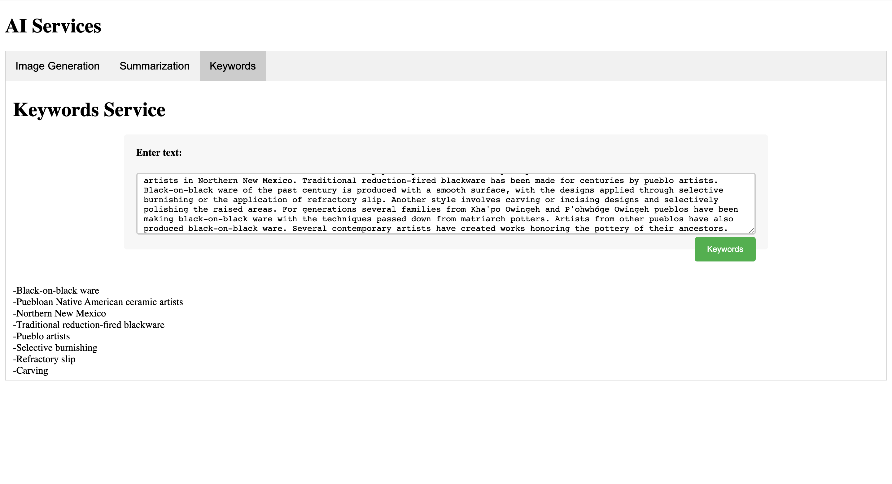

# AI Services

[Link to the AI-Services](https://38prjqcpnq.us-east-1.awsapprunner.com/)

- Image Generation based on a prompt
- Summary for a second-grade student
- Extract keywords from a text
- Perform Sentiment Analysis of a text


```
Summarize this for a second-grade student:

Black-on-black ware is a 20th- and 21st-century pottery tradition developed by the Puebloan Native American ceramic artists in Northern New Mexico. Traditional reduction-fired blackware has been made for centuries by pueblo artists. Black-on-black ware of the past century is produced with a smooth surface, with the designs applied through selective burnishing or the application of refractory slip. Another style involves carving or incising designs and selectively polishing the raised areas. For generations several families from Kha'po Owingeh and P'ohwhóge Owingeh pueblos have been making black-on-black ware with the techniques passed down from matriarch potters. Artists from other pueblos have also produced black-on-black ware. Several contemporary artists have created works honoring the pottery of their ancestors.
```


```
Extract keywords from this text:

Black-on-black ware is a 20th- and 21st-century pottery tradition developed by the Puebloan Native American ceramic artists in Northern New Mexico. Traditional reduction-fired blackware has been made for centuries by pueblo artists. Black-on-black ware of the past century is produced with a smooth surface, with the designs applied through selective burnishing or the application of refractory slip. Another style involves carving or incising designs and selectively polishing the raised areas. For generations several families from Kha'po Owingeh and P'ohwhóge Owingeh pueblos have been making black-on-black ware with the techniques passed down from matriarch potters. Artists from other pueblos have also produced black-on-black ware. Several contemporary artists have created works honoring the pottery of their ancestors.
```


```
Perform sentiment analysis of this text:

How can you develop a strong mind-heart-body connection to perform your best?

You likely spend months training for your next race by increasing distance and time running. What psychological factors can you cultivate to perform your best and increase you sense of well-being?

Optimism is a sense of hopefulness and confidence that things will work out well in the future and anticipating the best possible outcomes. Optimism is associated with more physical activity and other healthy behaviors (not smoking, healthy food choices, better sleep quality and higher heart health scores). Women with higher optimism had slower progress of plaque buildup in their arteries. Research shows that higher levels of optimism were associated with 35% decreased risk of cardiovascular disease events.  An optimistic mindset can help you reduce your risk of heart disease and reach your fitness goals.

Strategies to boost optimism: take negativity breaks and reframe with positive self-talk and imagine your “best self” and “best performance.”
```


### Follow these steps to deploy the service:

1. Build and push your Docker image to Amazon ECR.

2. In the AWS App Runner console, create a new service or update an existing one.

3. Add the environment variable in the "Environment" section:

If using the AWS App Runner console, find the "Environment variables" section, and click "Add environment variable". Set the "Name" as `OPENAI_API_KEY` and the "Value" as the actual API key value.

By setting the `OPENAI_API_KEY` environment variable using AWS App Runner environment settings, you ensure the API key is securely stored and available to the application during runtime without being exposed in the Docker image.

4. Refer to "Application logs" section in the AWS App Runner console for troubleshooting

### Note:
- Dockerfile
    1. Remember to copy the 'ui' directory from the builder stage to the runtime image  

- Docker rebuild
    1. Use the "--no-cache" option to rebuild the service
```bash
docker build --no-cache  -t ai-services .
```

### References:
- [summarize-openai-prj](https://github.com/nogibjj/rust-world-spr23/tree/main/summarize-openai-prj4)
- [openai-examples](https://platform.openai.com/examples)
